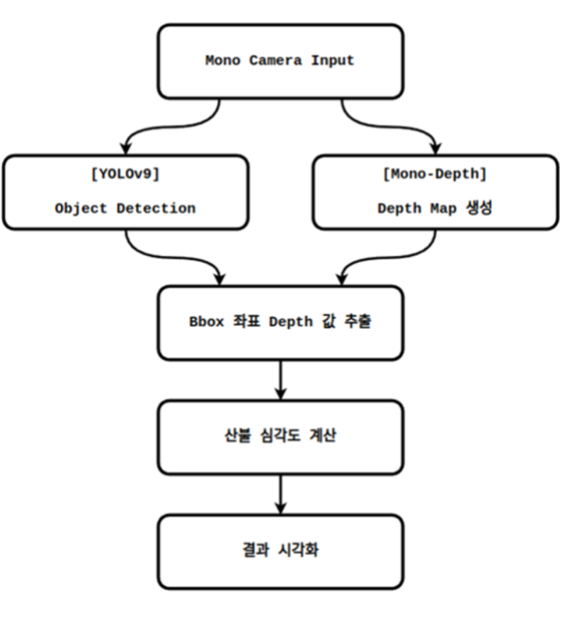
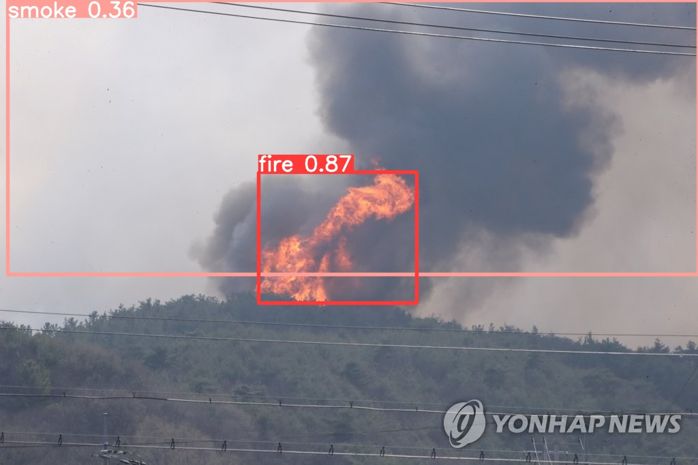

# Fire Detection AI Project

## 프로젝트 소개

본 프로젝트는 드론 카메라를 이용하여 실시간으로 산불을 감지하고 위험 수준을 평가하는 AI 시스템을 구축하는 것을 목표로 합니다. 주요 목적은 드론에서 수집된 영상 데이터를 분석하여 불과 연기를 감지하고, 초기 산불 징후를 신속하게 포착하여 대응 시간을 줄이는 것입니다.

### 프로젝트 주요 기능
1. **실시간 산불 탐지**: 드론 카메라로 수집된 영상 데이터를 실시간으로 분석하여 불과 연기를 감지합니다.
2. **위험 수준 분석**: 감지된 산불의 규모, 범위 및 확산 속도 등을 이용하여 현재 산불의 위험 수준을 평가합니다.
3. **드론 카메라 기반 탐지**: 별도의 센서 없이 드론 카메라만을 사용하여 산불 상황을 인식하고 분석합니다.

## 전체 기능도

## AI 모델 구조

- **YOLOv9 기반 탐지 모델**: 본 프로젝트는 YOLOv9 모델을 기반으로 학습을 진행하였으며, 경량화 및 Fine-tuning을 통해 모델의 효율성을 극대화했습니다. TensorRT를 적용하여 추론 속도를 대폭 향상시켰습니다.
- **Depth 정보 활용**: Pre-trained Monocular Depth 모델을 활용하여 산불의 깊이 정보를 추정하였고, YOLO 모델 학습에 사용된 데이터로 Fine-tuning을 진행했습니다. Depth 정보와 Bounding Box(BBox)의 크기 및 개수를 활용해 산불의 위험도를 평가합니다.
- **추론 성능 최적화**: YOLO 모델의 추론 속도를 개선하기 위해 TensorRT를 사용하여 경량화를 수행하고, 실시간 추론이 가능하도록 최적화하였습니다.

## 모델 경량화 및 Pruning

모델의 경량화를 위해 Pruning 기법을 적용하고, 이후 Fine-tuning을 통해 성능을 유지하며 효율성을 향상시켰습니다.

| 모델 종류                | Precision | Recall | mAP50  | mAP50-95 | Inference Speed (ms) |
|-------------------------|-----------|--------|--------|----------|----------------------|
| Just Training (All)     | 0.846     | 0.808  | 0.866  | 0.511    | 222.88               |
| Dynamic Pruning (All)   | 0.824     | 0.822  | 0.863  | 0.504    | 216.68               |
| Pruning + Fine-tuning   | 0.825     | 0.811  | 0.854  | 0.497    | 215.37               |

## Tensorrt 적용 결과

TensorRT를 사용하여 YOLOv9 모델의 추론 성능을 개선하였으며, 경량화된 모델과 비교하여 향상된 추론 속도를 기록했습니다.

| 모델 종류                | Precision | Recall | mAP50  | mAP50-95 | Inference Speed (ms) |
|-------------------------|-----------|--------|--------|----------|----------------------|
| Pruning + TensorRT (All)| 0.836     | 0.807  | 0.85   | 0.491    | 197.89               |
| Pruning (All)           | 0.84      | 0.8    | 0.853  | 0.493    | 215.97               |
| Original (All)          | 0.825     | 0.815  | 0.864  | 0.504    | 221.32               |

## 최종 결과 영상

- `gradio.final` 파일을 실행하여 얻은 시스템의 실행 화면입니다.

- 최종 모델을 이용한 산불 감지 결과는 위의 이미지에서 확인할 수 있습니다. 드론 카메라로 촬영된 영상에서 실시간으로 불과 연기를 탐지하여 신속한 대응이 가능함을 보여줍니다.

## 사용 기술 및 도구

- **프로그래밍 언어**: Python
- **플랫폼**: Ubuntu (NVIDIA Jetson Orin)
- **모델 및 도구**: YOLOv9, Gradio (UI 인터페이스 구축), Docker, TensorRT, Monocular Depth 알고리즘
- **실행 방법**: Gradio 인터페이스를 통해 `gradio.final` 파일을 실행하여 시스템을 구동할 수 있습니다.

## 프로젝트의 장점 및 한계

- **장점**:
  - 실시간 산불 감지가 가능하여 초기 대응 시간을 줄일 수 있음.
  - 드론 카메라만을 사용하기 때문에 추가 센서 비용이 발생하지 않음.
  - YOLOv9 모델의 경량화 및 최적화를 통해 추론 속도를 개선하여 실시간 탐지가 가능.

- **한계**:
  - 드론의 비행 시간 및 날씨 조건에 따라 감지 성능에 영향을 받을 수 있음.
  - Depth 모델의 추정 정확도가 낮은 경우 위험도 평가에 오류가 발생할 수 있음.

## 향후 개선 방향

- **다중 드론 연동**: 여러 대의 드론을 연동하여 넓은 범위의 산불을 동시에 감지하고, 상황을 종합적으로 평가하는 기능을 추가할 예정입니다.
- **ML 모델 성능 개선**: 현재 사용 중인 YOLOv9 모델의 성능을 더 향상시키기 위해 Pruning, Knowledge Distillation 등의 추가 경량화 및 최적화 방법을 적용할 계획입니다.
- **데이터 수집 및 모델 업데이트**: 다양한 산불 상황을 학습 데이터로 추가 수집하여 모델의 탐지 정확도를 개선할 것입니다.

## 연구 요약

### 서론

**연구의 동기 및 필요성**

산불과 같은 화재 사고는 발생 초기 단계에서 빠르게 대응할수록 피해를 최소화할 수 있습니다. 기존 화재 감지 드론은 배터리와 신뢰성 문제로 운용 비용이 높고 원활한 운용이 어려운 상황입니다. 본 연구는 카메라 영상 데이터만을 이용해 신속하게 화재를 감지하고 위험도를 평가할 수 있는 경량화된 AI 모델을 개발하는 것을 목표로 합니다.

**기존 기술의 한계**

기존 화재 감지 드론은 열화상 센서, 가스 감지 센서 등 다양한 센서를 사용해 정밀도를 높이고 있으나, 연산 요구량이 높아 실시간 처리에 한계가 있으며 비용과 배터리 소모 문제가 발생합니다. 이를 해결하기 위해 카메라만을 활용한 경량화된 시스템을 제안합니다.

### 제안하는 연구 주제

**아이디어**

본 연구는 드론 카메라 영상만을 활용하여 실시간으로 화재를 감지하고 위험도를 분석하는 경량화된 AI 모델을 제안합니다. YOLOv9 모델을 기반으로 Pruning 및 TensorRT를 적용하여 경량화와 추론 속도 최적화를 수행하였고, Monocular Depth Estimation을 활용하여 화재 위치와 위험도를 분석합니다.

**최종 목표 및 기대효과**

1. **실시간 화재 감지와 위험도 분석**: 경량화된 모델을 통해 드론이 화재를 실시간으로 감지하고 위험 수준을 파악할 수 있습니다.
2. **비용 효율성**: 추가 센서 없이 카메라와 AI 모델만을 사용하여 장비 비용 절감 및 드론 운용 시간 극대화를 목표로 합니다.
3. **확장성**: 경량화된 모델을 다양한 드론 모델에 적용할 수 있도록 설계하였습니다.

### 연구 이론 및 기술

- **Monocular Depth Estimation**: 단일 RGB 이미지에서 깊이 정보를 추정하여 산불 발생 지점의 거리를 측정하고, 이를 기반으로 위험도를 평가합니다.
- **Object Detection (YOLOv9)**: 불과 연기를 실시간으로 탐지하기 위해 YOLOv9 모델을 활용하여 객체의 위치와 크기를 추정합니다.
- **Pruning 및 TensorRT**: Pruning 기법을 통해 모델 크기를 줄이고, TensorRT를 적용하여 GPU 기반 환경에서 실시간 추론 성능을 극대화했습니다.
